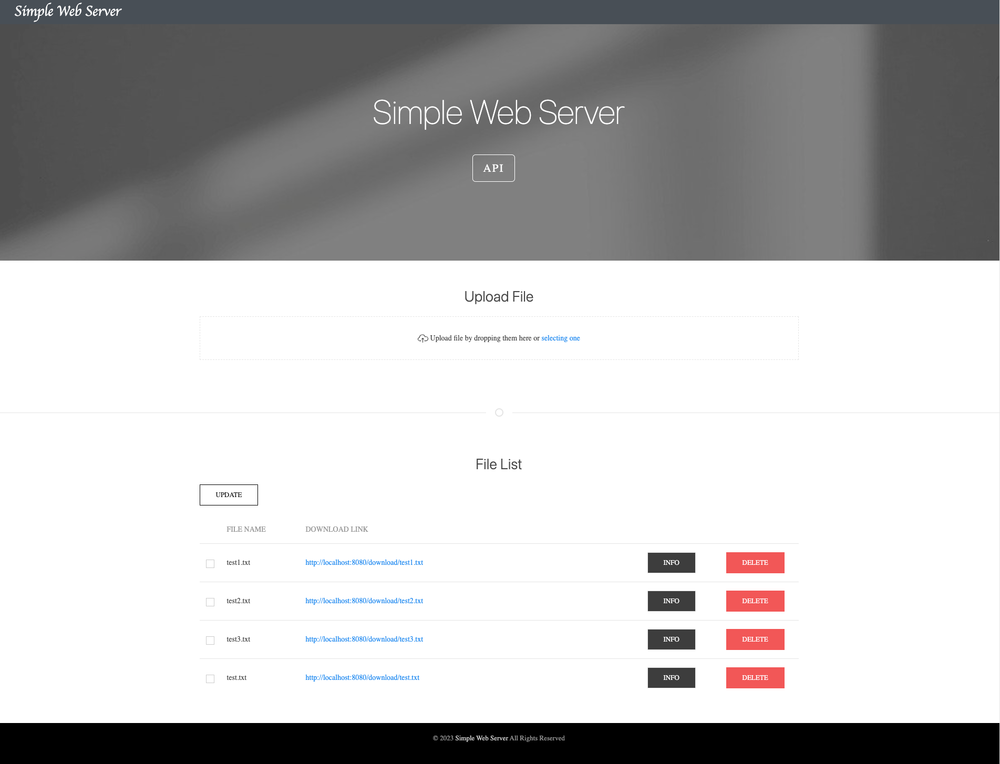

# File Upload and Download Server



This program is a simple file upload and download server implemented in Python. It provides a basic HTTP server that allows users to upload files, download files, and perform various file operations such as listing files, retrieving file information, updating files, and deleting files.

Please note that this program uses only the `socket` package in Python and does not rely on any other HTTP-specific packages or frameworks. It is implemented from scratch to demonstrate the underlying principles of HTTP communication and file handling.

## Environment Setup

1. Clone this repository to your local machine.
  
    ```=bash
    git clone https://github.com/Huaish/webserver.git
    ```

2. Install Python 3.10.7 or a compatible version.
3. Prepare Conda environment

    ```=bash
    conda create -n webserver python=3.10.7
    conda activate webserver
    ```

## Usage

1. Customize server settings (optional):
   - The program includes a few configurable parameters at the beginning of the code:
     - `STATIC_FOLDER`: The folder where static files (e.g., HTML, CSS, JavaScript) are stored.
     - `UPLOAD_FOLDER`: The folder where uploaded files will be stored.
     - `TOKEN`: A secret token used for authentication.
   - Modify these parameters according to your desired setup.

2. Run the server:

    ```=bash
    python server.py
    ```

3. Interact with the server:
   - Open a web browser and navigate to [http://localhost:8080/](http://localhost:8080/)

   - You can perform the following actions:
     - **Set Cookie**:
       - Method: `GET`
       - API: [http://localhost:8080/token](http://localhost:8080/tokeb)
       - Response: `301 Redirect` to [http://localhost:8080/](http://localhost:8080/)
       - The server includes a simple authentication mechanism using a token.
       - The `TOKEN` variable stores the secret token used for authentication.
       - Click on the `Set token` button to set the token as a cookie in your browser.
       - After setting the token, you can perform other actions on the server.

     - **Check Authentication**:
       - Method: `HEAD`
       - API: [http://localhost:8080/auth](http://localhost:8080/auth)
       - Response: `200 OK` if authenticated, `401 Unauthorized` if not authenticated.

     - **Upload a File**:
       - Method: `POST`
       - API: [http://localhost:8080/{file}](http://localhost:8080/{file})
       - Request:
         - Content-Type: `application/octet-stream`
         - Body: file content
       - Response:
          - Content-Type: `application/json`
          - Body:

            ```=json
              res = {
                'ok': True or False,
                'name': data['name'],
                'size': len(data['content']),
                'path': f'/file/{data["name"]}',
                'error': None or 'File exists'
              }
            ```

       - Click on the file upload button or a designated area on the webpage to select a file from your computer.
       - After selecting the file, it will be uploaded to the server's `UPLOAD_FOLDER`.
       - If a file with the same name already exists, an error will be displayed.

     - **Download a File**:
        - Method: `GET`
        - API: [http://localhost:8080/download/{file}](http://localhost:8080/download/{file})
        - Response:
          - Content-Type: `application/octet-stream`
          - Content-Disposition: `attachment; filename={file}`
          - Body: file content
        - Click on the file download link or button to download a file from the server.
        - The file will be downloaded to your computer.

     - **List Files**:
        - Method: `GET`
        - API: [http://localhost:8080/file-list](http://localhost:8080/file-list)
        - Response:
          - Content-Type: `application/json`
          - Body:

            ```=json
              res = {
                'ok': True,
                'files': [
                  {
                    'name': file_name,
                    'path': f'/file/{file_name}',
                    'size': file_size
                  },
                  ...
                ]
              }
            ```

        - Access the `/file-list` URL to get a list of uploaded files.
        - The server will respond with a JSON object containing file information, such as file name, URL, and size.

     - **Update a File**:
        - Method: `PUT`
        - API: [http://localhost:8080/{file}](http://localhost:8080/{file})
        - Request:
          - Content-Type: `application/octet-stream`
          - Body:
            - `file`: file content
            - `update_list`: "file1,file2,..."
        - Response:
          - Content-Type: `application/json`
          - Body:

            ```=json
              res = {
                'ok': True ot False,
                'update': [file1, file2, ...],
                'fail': [file1, file2, ...],
                'error': None or 'File not found'
              }
            ```

        - The file content will be replaced with the new content in the server's `UPLOAD_FOLDER`.
        - If the file does not exist, an error will be displayed.

     - **Delete a File**:
        - Method: `DELETE`
        - API: [http://localhost:8080/{file}](http://localhost:8080/{file})
        - Response:
          - Content-Type: `application/json`
          - Body:

            ```=json
              res = {
                'ok': True or False,
                'name': filename,
                'error': None or 'File not found'
              }
            ```

        - The file will be deleted from the server's `UPLOAD_FOLDER`.
        - If the file does not exist, an error will be displayed.

     - **Get File Info**:
        - Method: `HEAD`
        - API: [http://localhost:8080/{file}](http://localhost:8080/{file})
        - Response: `200 OK` if file exists, `404 Not Found` if file does not exist.
        - The server will respond with a JSON object containing file information, such as content type, size.

## Status Codes
The server responds with the following status codes:

- `200 OK`: The request was successful.
- `301 Moved Permanently`: The requested resource has been assigned a new permanent URI and any future references to this resource should use one of the returned URIs.
- `400 Bad Request`: The request could not be understood by the server due to malformed syntax.
- `403 Forbidden`: The server understood the request, but is refusing to fulfill it.
- `404 Not Found`: The server can not find the requested resource.
- `500 Internal Server Error`: The server encountered an unexpected condition which prevented it from fulfilling the request.
- `505 HTTP Version Not Supported`: The server does not support the HTTP protocol version used in the request.

## Postman

In this project, we also provide a Postman collection for testing the server. You can import the collection into Postman and use it to test the server.

1. Open Postman and click on the `Import` button.
2. Select the `UploadFile.postman_collection.json` file.
3. The collection will be imported into Postman.

## Customization

You can customize the server according to your requirements. Here are a few aspects you might consider modifying:

- **File Storage Locations**:
  - The `STATIC_FOLDER` variable determines the folder where static files (e.g., HTML, CSS, JavaScript) are stored. You can change this to point to your desired folder.
  - The `UPLOAD_FOLDER` variable determines the folder where uploaded files will be stored. Modify this to specify your desired upload location.

- **Authentication**:
  - The server includes a simple authentication mechanism using a token. The `TOKEN` variable stores the secret token used for authentication. Change this to a secure value for your application.

- **Additional Functionality**:
  - If you want to add more functionality or extend the server's capabilities, you can modify the code accordingly. The existing code provides a foundation for file upload, download, listing, updating, and deletion. You can build upon this foundation to suit your needs.

## Troubleshooting

If you encounter any issues or errors while running the server, please keep the following points in mind:

- Ensure that you have the necessary permissions to read/write files in the specified `STATIC_FOLDER` and `UPLOAD_FOLDER`.
- Check if any required Python modules are missing. If so, you can install them using the `pip` package manager or the `conda` package manager.
- Make sure that the specified host and port are not already in use by another application on your system.

If you have any questions or need further assistance, please let us know.
